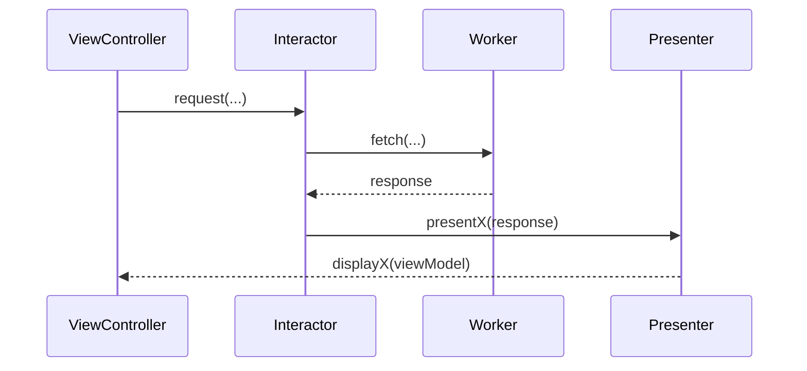

# Templates de documentos

Cabeçalho padrão de todo documento:

```markdown
# <Título>

> **Objetivo:** <uma frase>
> **Arquivos-fonte:** `<caminho1>`, `<caminho2>`
> **Última atualização:** <AAAA-MM-DD>
```

Rodapé padrão: seção "Veja também" com links relativos.

Omita seções que não se aplicam ao módulo; não invente conteúdo. Cena individual: use [scene.md](../assets/templates/scene.md). Dependências: veja [external-dependencies.md](./external-dependencies.md).

## `README.md` (visão geral e índice)
- O que é o módulo e qual problema resolve
- Funcionalidades (lista), versão, plataformas e deployment target
- Mapa da documentação (índice com links)
- Dependências principais (resumo e link para `external/README.md`)
- Como começar (link para integração)

## `architecture/overview.md`
- VIP no módulo: diagrama do ciclo (View, Interactor, Presenter, Worker, Router) em Mermaid
- Camadas e pastas, responsabilidades
- Convenções de nomes e organização
- Navegação e passagem de dados
- Injeção de dependências e providers
- Decisões e padrões recorrentes

## `integration/getting-started.md`
- Instalação (pod/SPM), configuração e inicialização (bridge, configuração, remote config)
- Pontos de entrada públicos e exemplos mínimos de uso
- Contratos que o app host deve fornecer
- Deep links e rotas expostas
- Erros comuns de integração

## `scenes/<cena>.md`
Use o template de cena. Inclua uma tabela índice em `scenes/README.md` com fluxos e links.

## `network/overview.md`
- Cliente, workers, providers, autenticação (sem tokens)
- Tabela de endpoints: nome, método, caminho relativo, request, response, quem chama
- Mapeamento e tratamento de erros
- Estratégia de mocks para rede

## `models/overview.md`
- Modelos de domínio compartilhados e de request/response, campos relevantes, enums e regras de validação
- Diagrama de classes (Mermaid) para os modelos centrais

## `configuration/overview.md`
- Bridge, configuração injetada, remote config, feature flags (nome, efeito, valor padrão, onde é lido)

## `analytics/events.md`
- Tabela: evento, parâmetros, cena/ação que dispara, arquivo-fonte

## `testing/overview.md`
- Estrutura de testes, convenções, mocks disponíveis (o que cada um simula), como escrever um teste de Interactor/Presenter, lacunas de cobertura

## `glossary.md`
- Termos de negócio e técnicos (sigla, definição, onde aparece)

## `open-points.md`
- Itens "A confirmar", TODO/FIXME relevantes, dívidas técnicas, inconsistências, sugestões
- Tabela: item, local, impacto, ação sugerida

## Diagramas Mermaid

- Sequência de um caso de uso:



- Use `flowchart` para navegação entre cenas e `classDiagram` para modelos.
- Evite parênteses e caracteres especiais em rótulos sem aspas; valide a sintaxe na revisão.
