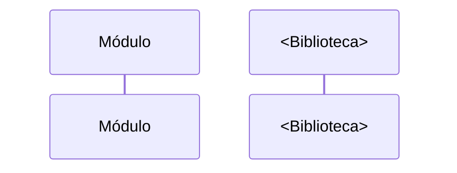

# <Biblioteca> (uso no módulo)

> **Objetivo:** <papel da biblioteca no módulo>
> **Origem/versão:** <caminho local ou versão do Podfile>
> **Nível de documentação:** Uso no módulo
> **Última atualização:** <AAAA-MM-DD>

## Propósito
<O que a biblioteca oferece e por que o módulo a utiliza.>

## Símbolos consumidos pelo módulo

| Símbolo | Tipo | Para que serve | Usado em |
|---|---|---|---|
| `<Nome>` | protocol/class/struct/func | | `<arquivo do módulo>` |

## Contrato e comportamento
<Para cada símbolo relevante: assinatura resumida, comportamento esperado, erros possíveis, requisitos de configuração.>

## Interação com o módulo

## Pontos de atenção
<Acoplamentos, versões, limitações, "A confirmar".>

## Veja também
- <links relativos>
