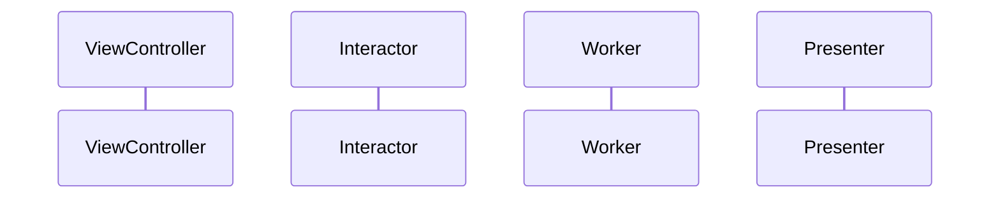

# Cena: <Nome da cena>

> **Objetivo:** <o que a cena faz para o usuário>
> **Arquivos-fonte:** `<pasta da cena>/`
> **Última atualização:** <AAAA-MM-DD>

## Visão geral
<Descrição curta do fluxo de negócio e quando a cena é exibida.>

## Entrada e saída
- **Quem abre:** <cena/rota/deep link>
- **Parâmetros de entrada:** <tipos e origem>
- **Navega para:** <cenas de destino e dados passados>

## Componentes VIP

| Componente | Arquivo | Responsabilidade |
|---|---|---|
| ViewController | `...ViewController.swift` | |
| Interactor | `...Interactor.swift` | |
| Presenter | `...Presenter.swift` | |
| Router | `...Router.swift` | |
| Worker/Provider | `...Worker.swift` | |
| Models | `...Models.swift` | |

## Casos de uso

| Caso de uso | Request | Response | ViewModel |
|---|---|---|---|

## Fluxo principal

## Estados e erros
<loading, sucesso, erro, vazio; tratamento de erros.>

## Regras de negócio
<Regras evidentes no código. Use "A confirmar" para o que não for claro.>

## Analytics
| Evento | Quando dispara |
|---|---|

## Feature flags e configuração
<flags/remote config que afetam a cena.>

## Testes
<Testes existentes e mocks usados.>

## Veja também
- <links relativos>
