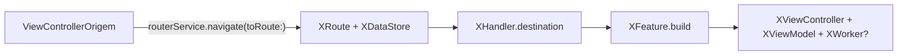

# Arquitetura MVVM + RouterService — PaymentGateway

> Baseado em análise real do código em `PaymentGateway/Classes/PaymentChoice`,
> `PaymentTypeSelector`, `PaymentErrorHandler` e `PaymentValidation`. Nenhuma
> informação aqui foi inventada — tudo tem um exemplo correspondente no repositório.

## Visão Geral

Cada cena ("feature") é composta por um conjunto de arquivos que se conectam através
de um mecanismo de navegação por `Route` (pod `RouterServiceInterface`) e injeção
de dependência via property wrapper `@Dependency` (pod `CompositionRootInterface`).



## Camadas

### 1. `{Feature}Route` + `{Feature}DataStore` (Interface)

- `DataStore`: `struct` pública e imutável, carrega os dados que a cena recebe da
  cena anterior (ex: `PaymentChoiceDataStore` carrega `compositionPaymentData` e um
  delegate `compositionData: PaymentGatewayDataProvider?`).
- `Route`: `struct` pública conforme `Route`, com `static let identifier` e o
  `dataStore`. É o "endereço" usado para navegar.
- Localização observada: cenas expostas como ponto de entrada do pod (ex:
  `PaymentChoice`) ficam em `PaymentGatewayInterface/Classes/Model` e
  `.../Route`. Cenas de navegação só interna ao pod (ex: `PaymentTypeSelector`,
  `PaymentErrorHandler`) às vezes ficam locais em `{Feature}/Interface/`, com
  visibilidade `internal` (`PaymentErrorRoute`) ou `public` (`PaymentTypeSelectorRoute`).
  **Decisão adotada pela skill `mvvm-router-new-feature`: sempre gerar em
  `PaymentGatewayInterface` (público), para manter consistência.**

### 2. `{Feature}Handler` (Implementation)

```swift
public final class {Feature}Handler: RouteHandler {
    public var routes: [Route.Type] = [{Feature}Route.self]
    public init() {}
    public func destination(forRoute route: Route) -> Feature.Type {
        guard route is {Feature}Route else { preconditionFailure() }
        return {Feature}Feature.self
    }
}
```

Precisa ser registrado manualmente em
`Example/Example/ModulesRegistration/PaymentGatewayRegistration.swift`
(`routerService.register(routeHandler: ...)`). **Gap conhecido no projeto:**
`PaymentErrorHandler` não está registrado ali apesar de ser navegado via
`routerService?.navigate(toRoute:)` a partir de outras cenas — não replique esse gap
em código novo; sempre registre o Handler.

### 3. `{Feature}Feature` (Implementation)

```swift
final class {Feature}Feature: Feature {
    @Dependency var routerService: RouterServiceProtocol
    @Dependency var apiService: (APIServiceLogic & APIServiceData) // só se houver Worker

    func build(fromRoute route: Route?) -> UIViewController {
        guard let route = route as? {Feature}Route else { preconditionFailure() }
        let viewController = {Feature}ViewController(routerService: routerService)
        viewController.modalPresentationStyle = .fullScreen
        let viewModel = {Feature}ViewModel(notification: viewController, worker: worker)
        viewModel.dataStore = route.dataStore
        viewController.viewModel = viewModel
        return viewController
    }
}
```

- Resolve as dependências via `@Dependency` (nunca via `init` manual do app).
- Injeta o `dataStore` do `Route` no `ViewModel` **depois** de construí-lo (a
  propriedade `dataStore` do ViewModel é `var`, não passada no `init`).
- Outras dependências vistas em produção: `StorageService`
  (`PaymentChoiceFeature`).

### 4. `{Feature}Model` (Implementation)

```swift
struct {Feature}Model {
    struct SceneModel: PaymentGatewayModel {
        var items: [ListItemModel]?
        var amount: String
        // ...
    }
}
```

Modelo plano usado exclusivamente para alimentar a `View`. Não tem lógica.

### 5. `{Feature}ViewModel` (Implementation)

Dois protocolos:

- `{Feature}ViewModelService` — chamado pela `ViewController` (`fetchValues()`,
  getters, tracking de analytics, etc).
- `{Feature}ViewModelNotification` — `weak` delegate implementado pela
  `ViewController` para receber callbacks assíncronos (`didUpdate()`,
  `handleError(...)`, `dismissView()`, etc).

Responsabilidades observadas:
- Contém toda a regra de negócio (equivalente ao Interactor do VIP, mas sem
  separação de Presenter — a formatação para exibição também acontece aqui).
- Chama o `Worker` (retorna `Promise`, via PromiseKit) e trata sucesso/erro com
  `.done`/`.catch`.
- Dispara eventos de Analytics diretamente (via `MotorGatewayAnalytics` ou, em
  cenas com pasta `Analytics/`, via um enum `{Feature}Events`).
- Expõe `var dataStore: {Feature}DataStore?` (setado pela `Feature` após o `init`).

### 6. `{Feature}ViewController` (Implementation)

- UIKit puro. Guarda `private let routerService: RouterServiceProtocol?`.
- Instancia `private let screenView = {Feature}View()` e a define como `view`
  via `override func loadView() { view = screenView }` — não monta subviews
  diretamente no `viewDidLoad()`.
- Delega toda ação de usuário ao `viewModel`; delega toda ação de UI (taps,
  etc.) da `{Feature}View` de volta para si via `{Feature}ViewDelegate`
  (`screenView.delegate = self`, setado em `viewDidLoad()`).
- **É quem efetivamente navega**: monta o próximo `{Next}Route`/`{Next}DataStore`
  a partir de dados do `viewModel` e chama:
  ```swift
  routerService?.navigate(toRoute: route, fromView: self,
                          presentationStyle: Push(), animated: true)
  ```
  Estilos de apresentação observados: `Push()`, `Present(modalPresentationStyle:)`,
  `ReplaceLast()`.
- Implementa a extensão `{Feature}ViewModelNotification` para reagir a callbacks
  do ViewModel (ex: `didUpdate()` chama um método privado `updateScene()`, que
  repassa o `sceneModel` para `screenView.setup(model:)`).

### 6a. `{Feature}View` (Implementation)

```swift
protocol {Feature}ViewDelegate: AnyObject {
    // ações que a view repassa para o ViewController
}

final class {Feature}View: UIView {
    weak var delegate: {Feature}ViewDelegate?

    override init(frame: CGRect) {
        super.init(frame: frame)
        setupViewCode()
    }

    func setup(model: {Feature}Model.SceneModel) {
        // aplica os dados do sceneModel nos componentes da tela
    }
}
```

- UIView dedicada da cena, concentra toda a montagem/constraints/estado visual
  da tela (equivalente à "regra de interface" ficar isolada da `ViewController`).
- Método `setupViewCode()` privado organiza `setupViews()` (aparência),
  `addViews()` (hierarquia) e `addConstraints()` (layout) — chamado a partir de
  ambos os inits (`init(frame:)` e `init?(coder:)`).
- Expõe `func setup(model: {Feature}Model.SceneModel)`, chamado pela
  `ViewController` para atualizar a UI a partir do `sceneModel` do ViewModel.
- Componentes visuais reaproveitáveis entre features continuam em
  `PaymentGateway/Classes/Views/` — `{Feature}View` é específica desta cena.

### 7. `{Feature}Worker` (Implementation, opcional)

```swift
protocol {Feature}WorkerLogic {
    func getData(params: Request) -> Promise<Response>
}

final class {Feature}Worker: {Feature}WorkerLogic {
    let apiService: APIServiceLogic
    init(apiService: APIServiceLogic) { self.apiService = apiService }
    func getData(params: Request) -> Promise<Response> {
        let request = {Feature}Provider(params: params)
        return Promise<Response> { seal in
            apiService.fetch(model: Response.self, request: request) { result in
                switch result {
                case .success(let response): seal.fulfill(response)
                case .failure(let error): seal.reject(error)
                }
            }
        }
    }
}
```

Só existe quando a cena precisa chamar API. Usa `PromiseKit` e `BDServiceProviderInterface`.
`{Feature}Request`/`{Feature}Response` vêm de `{Feature}Contract.swift` (ver seção 7a) — o Worker não define esses tipos, apenas os consome.

### 7a. `{Feature}Contract` (Implementation, opcional)

```swift
struct {Feature}Request {
    // TODO: campos enviados para a API.
}

struct {Feature}Response: Decodable {
    // TODO: campos retornados pela API.
}
```

Arquivo único com `{Feature}Request` e `{Feature}Response` juntos, ao lado do
`{Feature}Worker.swift`. Só existe quando a cena precisa chamar API (mesma
condição do Worker/Provider). Diferente de `{Feature}DataStore`/`{Feature}Route`,
este contrato **não** vai para `PaymentGatewayInterface`: é um detalhe de
implementação da própria feature, consumido apenas pelo `Worker` e pelo
`Provider` dela — nenhuma outra feature/pod precisa enxergá-lo.

### 8. `{Feature}Provider` (opcional, dentro de `Provider/`)

```swift
final class {Feature}Provider: RequestProvider {
    var httpMethod: RequestHTTPMethod { .get }
    var path: String { "/api--.../..." }
    let params: Request
    init(params: Request) { self.params = params }
    var headers: [String: String] { [...] }
}
```

Define o contrato HTTP (`path`, `httpMethod`, `headers`/body). Só existe quando o
`Worker` correspondente existe.

### 9. `Resources/{Feature}.strings` + `{Feature}Keys.swift`

```swift
enum {Feature}Keys {
    enum Localized: String, Localizable {
        case defaultTitle
        var tableName: String { "{Feature}" }
    }
}
```

Localização usando `Extensions` (`Localizable` protocol). O `tableName`
corresponde ao nome do `.strings`.

### 10. `Analytics/` (opcional, não gerado por esta skill)

Presente em `PaymentChoice` e `PaymentValidation`, ausente em
`PaymentTypeSelector`/`PaymentErrorHandler`. Quando existe, segue o padrão:
`enum {Feature}Events: PaymentGatewayAnalyticsProtocol` com casos por estado de
tela (`loading`, `error`, `success`), cada um com um `EventsModel` associado
conforme `PaymentGatewayAnalyticsParametersProtocol` (arquivos
`{Feature}Events+Base/Loading/Error/Success.swift`). Como esse padrão não é
universal, a skill de scaffolding não o gera automaticamente — avalie caso a
caso e replique manualmente a partir de `PaymentChoice/Analytics/` se necessário.

## Diferenças em relação à arquitetura VIP (`vip-*` skills)

| VIP (Clean Swift) | MVVM + RouterService (este pod) |
|---|---|
| Interactor + Presenter + DataStore separados | Tudo concentrado no `ViewModel` |
| `Router` cuida de navegação e `DataPassing` | O próprio `ViewController` navega via `RouterService` injetado |
| Protocolo `...BusinessLogic`/`...DisplayLogic` | Protocolos `...ViewModelService`/`...ViewModelNotification` |
| Módulo isolado, sem DI global | `@Dependency` (property wrapper) resolve dependências globais |
| Navegação local (`show`, `present`) | Navegação por `Route` registrado em `RouteHandler` |
